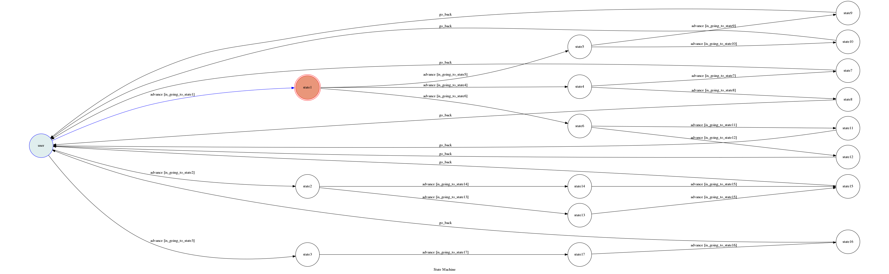

# TOC Project 2017

A telegram bot based on a finite state machine.


In this final project, I can communicate with my telegram chatbot. 

## Setup

### Prerequisite
* Python 3

#### Install Dependency
```sh
pip install -r requirements.txt
```

* pygraphviz (For visualizing Finite State Machine)
    * [Setup pygraphviz on Ubuntu](http://www.jianshu.com/p/a3da7ecc5303)

### Secret Data

`API_TOKEN` and `WEBHOOK_URL` in app.py **MUST** be set to proper values.
Otherwise, you might not be able to run your code.

### Run Locally
You can either setup https server or using `ngrok` as a proxy.

**`ngrok` would be used in the following instruction**

```sh
ngrok http 5000
```

After that, `ngrok` would generate a https URL.

You should set `WEBHOOK_URL` (in app.py) to `your-https-URL/hook`.

#### Run my chatbot

```sh
python3 app.py
```

## Finite State Machine


## Usage
The initial state is set to `user`.

Every time `user` state is triggered to `advance` to another state, it will `go_back` to `user` state after the bot replies corresponding message.

In this project, there are there usage of my chatbot: To list hotels in Tainan, movie theater timetable and Tainan one day tour.

## Descriptions
First, I need to choose one of three options to ask my chatbot.

My options:
1. `Hotels`
2. `Movie theater`
3. `Tainan sights`

After the chatbot reply the message, you can ask next further questions related to your option.

Here, I described the input scheme:
1. **Hotels**
    1. `Top 5 review`
        * price
        * location
    2. `Top 5 price`
        * review
        * location

    3. `Top 5 near ncku`
        * review
        * price

2. **Movie theater**
    1. `Guopin`
        * Now trending 
    2. `Viewshow`
        * Now trending

3. **Tainan Sights**
    * `One day tour`
        * Dine

And the chatbot will reply the answer of the above input strings one by one.

    *(P.S. It's not efficient to write it all the answer here)*

## Author
[Angelina Anggara](https://github.com/angelinaanggara1996)

